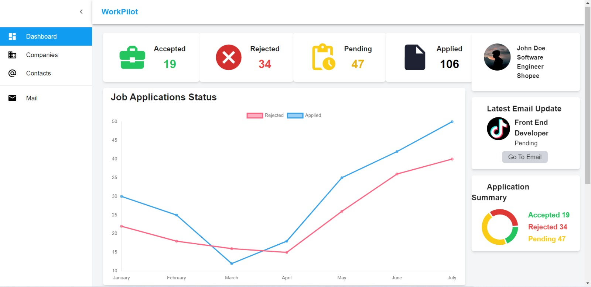

# WorkPilot

 

## Inspiration

Are you tired of drowning in the sea of job applications, struggling to keep track of everything? Do you wish for a simple and efficient solution to take your job search to new heights? Look no further, for **WorkPilot** is here to revolutionise the way you approach your job hunt. Say goodbye to chaos and welcome the order and control you've been longing for. Join us today and take the first step towards your dream career.

## What it does

WorkPilot is an innovative platform designed to simplify the process of managing job applications. By connecting directly with your email, the system automatically analyzes and categorizes your job applications for the follwing benefits:

- Presenting emails in an organized and easily accessible format on your personalized dashboard.
- Filter applications by company and track their progress to stay top of your job search with ease.
- View the entire email thread related to a specific application for valuable context and ensuring that you never miss an important communication.
- Experience a streamlined and efficient job application management process with our cutting-edge website.

## How we built it

The WorkPilot was built using state-of-the-art technologies and tools.

- **Machine Learning**: To enable the platform's intelligent email analysis, we implemented machine learning and natural language processing (NLP) techniques. Specifically, we trained a **Multinomial Naive Bayes classifier** on a corpus of job application status update emails, while the Spacy library was used to extract information (Named Entity Recognition) from the emails.
- **Front-end development**: For front-end development, we leveraged **React** and **Tailwind CSS** to build a sleek and intuitive user interface.
- **Cloud Architecture**:Our deployment architecture relied on a suite of AWS services, including **Fargate, Cognito, S3, SageMaker, DynamoDB, Application Load Balancer, and Auto Scaling**. This enabled us to deliver a scalable, secure, and high-performance application to our users.

## Challenges we ran into

During the development of WorkPilot, we faced several challenges that required creative solutions:

- Integratiion with multiple cloud technologies, which required careful planning and coordination to ensure smooth interoperability.
- Containerizing our web application, which involved configuring and deploying the necessary infrastructure to support a containerized environment.
- Implementation of email parsing for Named Entity Recognition, which required fine-tuning our algorithms to accurately identify relevant information.
- Curation of a private data source to train our machine learning models. This involved sourcing and collecting a large volume of relevant data, carefully cleaning and organizing it, and ensuring it met our strict quality standards.

Despite these challenges, we persevered and developed a robust and effective solution that meets the needs of our users

## Accomplishments that we're proud of

We are incredibly proud of the many accomplishments we achieved during the development of the Job Application Management website:

- The design of a modern data architecture supports **high availability, low latency, and high security**. This enabled us to deliver a **fast, reliable, and secure platform** to our users.
- Successful integration with email clients to **automate and streamline** the job application management process.
- High accuracy of our Multinomial Naive Bayes classifier, which **effectively categorizes and organizes** job application emails for users.
- Successful implementation of cloud technologies, which allowed us to deliver a **scalable and efficient solution** that meets the needs of a wide range of users.

Overall, we believe that our accomplishments reflect our commitment to delivering innovative, high-quality solutions that make a real difference in people's lives.

## What's next for WorkPilot

Looking ahead, our next priority is to expand our target audience by making WorkPilot accessible to students for tracking their university applications. By broadening the scope of our platform, we aim to provide valuable support and assistance to students in managing the complex and often overwhelming process of applying to colleges and universities.

To achieve this goal, we plan to leverage our existing technology infrastructure and expertise, building on our experience in developing and deploying cloud-based solutions that are fast, reliable, and secure. Additionally, we will need to refine our algorithms and machine learning models to effectively categorize and organize university application emails, ensuring that our platform delivers the same high level of accuracy and performance that our users have come to expect.

Overall, we believe that expanding our platform to serve the needs of students will allow us to make a positive impact on a broader audience, while continuing to deliver innovative and effective solutions that simplify and streamline the application management process.

Submission by **Akshit Kumar, Siddhant Pathak, Ronan Mahtolia**
